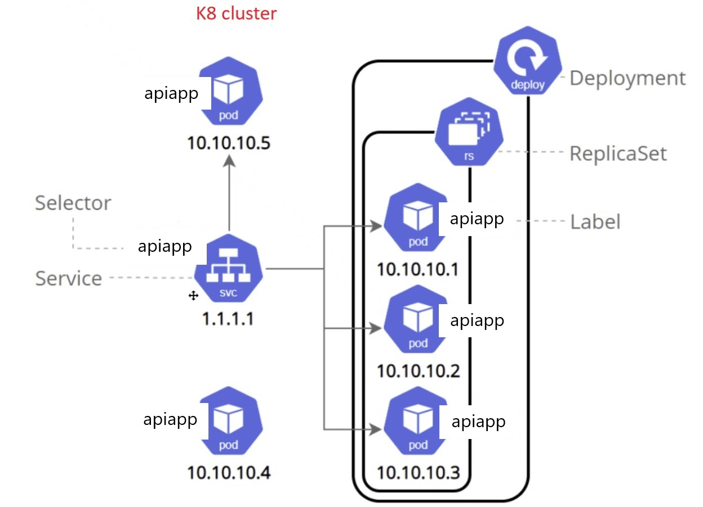
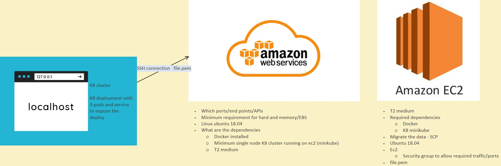

# SRE Intro
### User Journey
### User Experience
#### Cloud computing
#### AWS Services

---

- Creating github repo to push the markdown doc
- Amazon Web Services (AWS)

---

## Task

#### What is the role of SRE?
- Making sure whatever is bein deployed won't crash or cause any other problems
- If something does crash or if there are other problems then their role is to figure out what the problem is as quick as possible
- Asuring continuous operation

#### Benifits of cloud computing
- Ease of use
  - No need to set up own datacentre
  - Quick to deploy
- Flexibility
  - Easily scalable
  - Only use services you need
- Robustness
  - Deploying accross multiple AZs for redundecy
  - Scaling on demand
- Costs
  - Only pay for the resources that you use
  - Less up-front costs


#### AWS?
- Amazon Web Services
- On demand cloud computing


#### AWS global infrastructure
Consists of:
- 84 AZs
- Across 26 Regions


#### Regions VS Availability zones
- Regions are usually Countries or sections of a continent
  - They are collections of AZs
- Availability Zones (AZs) is a deployment area within a region


#### What are the four pillars of cloud computing
- Ease of use
- Flexibility
- Robustness
- Cost effective


#### What is a CDN?
- Content delivery network
- Caching content in a server closer to where people are trying to access it to allow for faster access


#### On Prem VS Hybrid - On Prem VS Public Cloud
- On Prem
  - Developing all the infrastructure you'll need yourself
- Hybrid
  - Owning some infrasructure for more sensitive data
  - Using cloud computing along side On Prem
  
- Public cloud
  - Using a service like AWS and using their pre-existing infrastructure to deploy

---
# Cloud Computing
### Public Cloud
- Secure it
- Security groups
- AWS file.pem
SSH command provided to us by AWS


Laptop/desktop
- Motherboard
- CPU
- GPU
- Harddrive
- Ram
- Audio

---

## Launching AWS Instance
### Local setup
- Put the SSH key into the .ssh folder
- run 'chmod 400 105.pem' to change the '105.prem' file to readonly

### AWS Setup
- Select EC2 instance
- Select instance OS
  - Choose ubuntu 18.04
- Select subnet 'DevOpsStudent 1a'
- Select resources 
  - default storage
  - family t2 micro
- Add tags (set name of instance)
- Enable public ip
- Setup rules (create security groups to allow port 22 (SSH) and port 80 (HTTP, use my ip))
- select 104a

### Once running
- run 'ssh -i "105.pem" ubuntu@ec2-54-216-127-89.eu-west-1.compute.amazonaws.com' to connect to the instance from the localhost

- run 'sudo apt-get update -y'
- run 'sudo apt-get upgrade -y'
- run 'sudo apt-get install nginx -y'
- Check that nginx has installed correctly by checking the public ip in a browser

---

## Linux Commands
- Using `sudo` before the command elevates the permissions for that command
- Use `top` to view currently running processes
- Creating an alias to make it quicker to use commands `alias {alias_name}="{command_you_want_to_alias}"`
- Services
  - How to check the status of a service `systemctl status name_service`
  - How to start a service `sudo systemctl start name_service`
  - How to stop a service `sudo systemctl stop name_service` If a service is set to start on instance startup, using this will stop the service and the service will not lauch automatically on startup next time
  - How to enable a service `sudo systemctl enable service_name` The service will now start on instance startup
- Packages
  - How to install a package `sudo apt-get install package_name -y` Using `-y` means that for any decisions that need to made installing the package yes will be selected
  - How to remove a package `sudo apt-get remove package_name -y`
- How to check all processes `top`
- Who am I `uname` or `uname -a`
- Directoies
  - Where am I `pwd` Print Working Directory
  - How to move into a directory `cd directory_path`
  - How to move up a directory `cd -` or `cd ..`
  - Create a directory `mkdir dir_name`
  - How to check directoies `ls` or `ls -a`
- Files
  - How to create file `touch name_file` or `nano file_name`
  - How to check the contents of a file without going inside the file `cat file_name`
  - How to move a file to another location `mv file_name directory_name`
  - How to delete a folder `sudo rm -rf folder_name` Focefully remove `-rf`

### File Permisions
- How to check a file permission `ll`
- How to change a file permission `chmod required_permission file_name`
- Write `w`, read `r`, exe `x`
- https://chmod-calculator.com/

### Bash scripting - Automate process with the script

```bash
# create file called provision.sh

#!/bin/bash

# run updates
sudo apt-get update -y

# run upgrade
sudo apt-get upgrade -y

# install nginx
sudo apt-get install nginx -y

# ensure it's running - start nginx
sudo systemctl start nginx

# enable nginx
sudo systemctl enable nginx
```
- change the file to exe `chmod +x provision.sh`
- how to run an exe file `./provision.sh`

---
### Bash script to automate Tomcat installation

Tomcat ports
- HTTP 8080
- HTTPS 8443
- AJP 8009

Use cases for tomcat:
- Static page hosting
- Reverse proxy
- Dynamic web applications via Java Servlets and JSP
- Running WebSocket applications
- Load balancers


Bash script Tomcat installation

```bash
# create file called tomcatSetup.sh

#!/bin/bash

# install nginx
sudo apt install tomcat9 -y

# ensure it's running - start nginx
sudo systemctl start tomcat9

# enable nginx
sudo systemctl enable tomcat9

# allow traffic to port 8080
sudo ufw allow from any to any port 8080 proto tcp
```
- change the file to exe `chmod +x tomcatSetup.sh`
- how to run an exe file `./tomcatSetup.sh`

---

## Technical Questions

What is a VPC?
- Vitual Private Cloud
- It is a secure, isolated private cloud that is hosted within a public cloud
- Combines the scalability of a public cloud with the isolation of your data a private cloud


What is an Internet Gateway?
- It is a VPC component that allows communication between the VPC and the internet
- Enables resources like EC2 instaances to connect to the internet


What are Route tables?
- A set of rules called routes that determine where network traffic from your subnet or gateway is directed
- A route table tells network packets which way they need to go to get to their destination


What is a Subnet?
- A range of IP addresses in your VPC
- Dividing the network up into two or more networks
- Makes conecting quicker
- They can be public or private
- They cannot span availability zones


What is NACL?
- Network Access Control List
- Similar to security groups for EC2 instances, but are for networks
- They can be attatched to one or more subnets within a VPC
- ACLs monitor and filter traffic moving in and out of a network
- On subnets


What is a Security group?
- A virtual firewall that controls traffic
- Allows you to set the rules for inbound and outbound traffic
- What ports are accessible and by what IPs


How did you secure your app on the public cloud?
- Using a security group we allowed only ports that we knew we were used by nginx and Tomcat
- We only allowed our own IP on SSH


What are the outbound rules for a security group by default and why?
- Allows all outbound IPv4 traffic and IPv6 traffic
- The inbound traffic is already restricted
- As it is all outbound it is safe for everyone have access

What is the command to kill a process in linux?
- Find the process id using `top`
- run `sudo kill -9 process_id`
- Alternativly to kill all processes of a given name `sudo killall process_name`

---

# Monolith - N-tier - 2-tier & Microservices Architecture

Scale up on increased data size including larger database or larger plugin size

Scale out on more users

### <br>Monolith Architecture

- Single big service
- Poor scalability
- Heavy apps can slow down the start up time
- Each update results in redeploying the full stack app


### Micro-services architecture

- Many small independant services
- For users to not have access to any database
- They are able to be worked on and updated independantly
- Adding features/services requires less refactoring


### N-tier
- Divides the application up into logical layers and physical tiers
- Layers are a way seperate responsibilities and manage dependancies
- A higher layer can use services in a lower layer, but not the other way around


### 2-tier
- Seperation of interface and data layers

---

# Continuous Integration and Continuous Delivery and Deployment

### Continuous Integration

- Developers will merge and commit code to the master branch multiple times a day
- There will be a fully automated building and testing process that gives quick feedback
- Avoids problems with waiting for release day to merge

### Continuous Delivery

- In addition to the steps in CI, there is also automated release of the product

### Continuous Deployment

- In addition to both the steps in delivery and integration, Continuous Deployment automates deploying the product to the customers

---

# SDLC

It’s the process of end to end product development.
Products need to follow a certain life cycle.
The Stages are:
- Planning
  - Just an idea, only in someone’s head

- Designing
  - Writing out how the product will look and what it needs.

- Development
  - Develop an environment that works for all of us. i.e the linux instance we created
  - Implementing the design.

- Testing
  - Nothing goes to production without testing.
  - The test must pass in order to go to the next stage.
  - Beta versions can happen after testing to get feedback from the user.

- Staging
  - It’s the holding area before the code gets deployed. The program is packaged and ready, just on hold till the release date. After staging the code is deployed.

---

# Github
Best practices and tips
- One person reviewing is always the best.
- Someone who is more knowledgeable should merge.
- Using `git` you will get a list of all the commands that can be performed on git
- If you delete the .git file you need to reconnect to the github remote before pushing the code back to github

---

# S3
S3 is a simple storage service on AWS

S3 standard class
- Used for data you need constant access to

S3 glacier class
- Takes time to retrieve
- Used for long term storage of very infrequently accessed data

```bash
#setup to use S3 from command line

#update and upgrade
sudo apt-get update -y
sudo apt-get upgrade -y


#install python 3.7
sudo apt-get install python
sudo apt-get install python3-pip

alias python=python3

sudo apt-get update -y
sudo apt-get upgrade -y


#install aws cli
python3 -m pip install awscli

sudo apt install awscli


#configure awscli
input access key id
input secret access key
input regoin name (eu-west-1)
input output format (json)
```

```bash
#creating a bucket on s3
aws s3 mb s3://bucket_name

#uploading data from ec2 to s3
aws s3 cp filename s3://s3_destination

#download from s3
aws s3 cp s3://s3_filepath/filename filename

#delete a file from s3
aws s3 rm s3://filepath/filename

#delete the bucket
aws s3 rb s3://bucket_name
```

---

# Virtual machines and Containerisation
Containerisation platforms
- Crio
- Rocket
- Docker (the most popular))

### <br>Virtual machines
- Can be very resource heavy
- Large size
- Slow
- Bad integration

### Containers
- Shares resources
- Small size
- Quick
- Good integration
<br><br>


## <br>Docker
- Docker is a containerisation platform
- You can download images off of docker hub and run using containers

### Docker Architecture


### <br>Docker Container life cycle


### Installing Docker
Prerequisites
- Enable CPU virtualisation in your bios
- In `windows features` turn on `Hyper-Visor`

Installation instructions
- Download and install docker hub
  - Should get messege asking you to install WLS2 (windows linux subsystem)
- Log-in to docker hub


### Commands
- List running containers `docker ps` and their ids
- Remove a container `docker rm container_id` 
- `docker run -d -p portnumber image_name` running an image and setting ports to use
- Start container `docker start container_id`
- Stop container `docker stop container_id`
- Enter containers terminal `docker exec -it container_id sh`
- Copy file to docker container `docker cp file_name container_id:file_path_in_container`
- `-d` detatched
- `-p` port map

Docker Cheat Sheet https://dockerlabs.collabnix.com/docker/cheatsheet/

### Using Docker hub as a repository
- Make a commit `docker commit container_id dipojosh/105_sre_josh:tag_name`
- Push commit to repo `docker push dipojosh/105_sre_josh:tag_name`
- Pulling and running a repo `docker run -d -p 80:80 dipojosh/105_sre_josh:latest`


## <br>Automation of custom Docker image creation

### Creating a Docker file to automate the proces of building a customised image - Building a Microservice with Docker
Automating image building of our customised nginx image
- Create a `Dockerfile` in the same location where our index.html is
- Decide which base image to use for your image


### Automation script
```docker
# select base image (you can also use tags)
FROM nginx

# Label it - add optional details
LABEL MAINTAINER=JOSH

# copy index.html to /usr/share/nginx/html/
COPY index.html /usr/share/nginx/html

# expose the required port - port 80
EXPOSE 80

# launch the app
CMD ["nginx", "-g", "daemon off;"]
# CMD will runthe command in this case to launch the image when we create a container
```
Build the image `docker build -t dipojosh/105_sre_nginx_test .`

### Test the image locally to ensure it works
- Run the image `docker run -p 80:80 dipojosh/105_sre_nginx_test:latest`
- Check `localhost`
- Should see our edited index.html page


## <br>Building a microservice of our API project

Plan
- Choose base image to use  https://docs.docker.com/samples/dotnetcore/
- Copy app into image
- Launch the app with the correct port


Make sure API project has been published already

```docker
# selecting the base image
FROM mcr.microsoft.com/dotnet/aspnet:6.0

# copying published API prohject to the image
COPY bin/Release/net6.0/publish/ App/

WORKDIR /App
ENTRYPOINT ["dotnet", "Employee(Controllers).dll"]
```
- The Dockerfie needs to be placed inside the directory with the `.csproj` for out project
- We then build the image with `docker build -t dipojosh/105_sre_api .` from a terminal inside the same folder

### Testing the image
- Run the image with `docker run -p 5001:80 dipojosh/105_sre_api:latest` (doesnt have to use port 5001, just an availabe port)
- Check `localhost:5001/swagger/index.html`
- Make sure the browser is not trying to use https (remove the s)
- If it works the swagger api ui should be showing

---

## <br>Kubernetes
- Also known as K8
- Benifits
  - Self healing: When a node goes down for whatever reason, traffic is diverted from it and a new node is created to take its place
  - Load Balancing and Service Discorvery
  - Automated rollouts and rollback
  - Auto Scaling
  - Autmoatic bin packing
  - Storage orchestration

### <br>K8 Architecture


### K8 set up
- In docker desktop go to settings, then Kubernetes and enable Kubernetes
- run `kubectl get svc` to check that its running

### K8 commands
- kubectl get service_name - deployment - pod - rs

- kubectl get svc svc_name
- kubectl get deploy nginx_deploy

- kubectl get pods
- kubectl describe pod pod_name

#### Kubernetes Cheat Sheet
```bash
kubectl controls the Kubernetes cluster manager.

 Find more information at: https://kubernetes.io/docs/reference/kubectl/overview/

Basic Commands (Beginner):
  create        Create a resource from a file or from stdin
  expose        Take a replication controller, service, deployment or pod and expose it as a new Kubernetes service
  run           Run a particular image on the cluster
  set           Set specific features on objects

Basic Commands (Intermediate):
  explain       Get documentation for a resource
  get           Display one or many resources
  edit          Edit a resource on the server
  delete        Delete resources by file names, stdin, resources and names, or by resources and label selector

Deploy Commands:
  rollout       Manage the rollout of a resource
  scale         Set a new size for a deployment, replica set, or replication controller
  autoscale     Auto-scale a deployment, replica set, stateful set, or replication controller

Cluster Management Commands:
  certificate   Modify certificate resources.
  cluster-info  Display cluster information
  top           Display resource (CPU/memory) usage
  cordon        Mark node as unschedulable
  uncordon      Mark node as schedulable
  drain         Drain node in preparation for maintenance
  taint         Update the taints on one or more nodes

Troubleshooting and Debugging Commands:
  describe      Show details of a specific resource or group of resources
  logs          Print the logs for a container in a pod
  attach        Attach to a running container
  exec          Execute a command in a container
  port-forward  Forward one or more local ports to a pod
  proxy         Run a proxy to the Kubernetes API server
  cp            Copy files and directories to and from containers
  auth          Inspect authorization
  debug         Create debugging sessions for troubleshooting workloads and nodes

Advanced Commands:
  diff          Diff the live version against a would-be applied version
  apply         Apply a configuration to a resource by file name or stdin
  patch         Update fields of a resource
  replace       Replace a resource by file name or stdin
  wait          Experimental: Wait for a specific condition on one or many resources
  kustomize     Build a kustomization target from a directory or URL.

Settings Commands:
  label         Update the labels on a resource
  annotate      Update the annotations on a resource
  completion    Output shell completion code for the specified shell (bash or zsh)

Other Commands:
  api-resources Print the supported API resources on the server
  api-versions  Print the supported API versions on the server, in the form of "group/version"
  config        Modify kubeconfig files
  plugin        Provides utilities for interacting with plugins
  version       Print the client and server version information

Usage:
  kubectl [flags] [options]
```

## <br>YAML

### What are the use cases
- can be utilised with K8, Docker-compose, Ansible, Cloud-format
- To codify anything and everthing in order to automate processess


### <b><br>Deploying our custom nginx container and service</b>

<br>Deployment
```yml
# YML is case sensitive
apiVersion: apps/v1 # which api to use for deployment
kind: Deployment # what kind of service/object you want to create

# What would you like to call it
metadata:
  name: nginx-deployment # naming the deployment

spec:
  selector:
    matchLabels:
      app: nginx # look for this label to match with k8 service
  
  # Lets create a replica set of this with 2 instances/pods
  replicas: 3

  # template to use its label for k8 service to launch in the browser
  template:
    metadata:
      labels:
        app: nginx # this label connects to the service or any other k8 components
    
    # lets define the container spec
    spec:
      containers:
      - name: nginx
        image: dipojosh/105_sre_nginx_test:latest
        ports:
        - containerPort: 80
```
`kubectl create -f nginx-deploy.yml` to create the deployment

<br>Service
```yml
# select the type of API version and type of service/object
apiVersion: v1
kind: Service

# metadata for name
metadata:
  name: nginx-svc
  namespace: default # sre
# specification to include ports selector to connect to the deploy
spec:
  ports:
  - nodePort: 30442 # range is 30000 - 32768
    port: 80
    protocol: TCP
    targetPort: 80

# lets define the selector and label to connect to nginx deployment
  selector:
    app: nginx # this label connects this service to deployment

  # creating LoadBalancer type of deployment
  type: LoadBalancer
```
`kubectl create -f nginx-svc.yml` to create the service


### <b><br><br>Deploying our API container and service</b>


<br>Deployment diagram
<br><br>


<br>Deployment
```yml
# YML is case sensitive
apiVersion: apps/v1 # which api to use for deployment
kind: Deployment # what kind of service/object you want to create

# What would you like to call it
metadata:
  name: nginx-deployment # naming the deployment

spec:
  selector:
    matchLabels:
      app: apiapp # look for this label to match with k8 service
  
  # Lets create a replica set of this with 2 instances/pods
  replicas: 3

  # template to use its label for k8 service to launch in the browser
  template:
    metadata:
      labels:
        app: apiapp # this label connects to the service or any other k8 components
    
    # lets define the container spec
    spec:
      containers:
      - name: apiapp
        image: dipojosh/dipojosh/105_sre_api:latest
        ports:
        - containerPort: 80
```
`kubectl create -f apiapp-deploy.yml` to create the deployment

<br>Service
```yml
# select the type of API version and type of service/object
apiVersion: v1
kind: Service

# metadata for name
metadata:
  name: apiapp-svc
  namespace: default # sre
# specification to include ports selector to connect to the deploy
spec:
  ports:
  - nodePort: 30442 # range is 30000 - 32768
    port: 80
    protocol: TCP
    targetPort: 80

# lets define the selector and label to connect to nginx deployment
  selector:
    app: apiapp # this label connects this service to deployment

  # creating LoadBalancer type of deployment
  type: LoadBalancer
```
`kubectl create -f apiapp-svc.yml` to create the service


- Edit a deployment `kubectl edit deploy deployment_name`
- Delete a deployment `kubectl delete deploy deployment_name`
- Delete a service `kubectl delete svc service_name`


---

# Kubernetes and Docker on ubuntu

Plan for API projectdeployment using kubernetes and docker on AWS



## Setup
Tutorial https://aws.plainenglish.io/running-kubernetes-using-minikube-cluster-on-the-aws-cloud-4259df916a07

### Create EC2 instance
- Choose ubuntu 18.04
- Select T2 Medium (2 virtual CPUs are required)
- Set up security rules
  - HTTP --- port: 30000 - 32768 --- IPs: All ipv4
- Launch

### Installing kubectl
- `curl -LO https://storage.googleapis.com/kubernetes-release/release/`curl -s https://storage.googleapis.com/kubernetes-release/release/stable.txt`/bin/linux/amd64/kubectl`
- `chmod +x ./kubectl`
- `sudo mv ./kubectl /usr/local/bin/kubectl`

### Install Docker
- `sudo apt-get install docker.io -y`

### Install Minikube
- `curl -Lo minikube https://storage.googleapis.com/minikube/releases/latest/minikube-linux-amd64 && chmod +x minikube && sudo mv minikube /usr/local/bin/`
- Kubernetes requires conntrack `sudo apt install conntrack`

### Starting Minikube
- `sudo minikube start --vm-driver=none`

## <br>Deployment

### Copying the files to EC2
- Create a folder on EC2 to store the `yml` files
- `scp -i ~/.ssh/105.pem ~/SPARTA/105_sre/apiapp-deploy_AWS/apiapp-deploy.yml ubuntu@ec2-52-208-191-119.eu-west-1.compute.amazonaws.com:/home/ubuntu/apiappDeployment`
- `scp -i ~/.ssh/105.pem ~/SPARTA/105_sre/apiapp-deploy_AWS/apiapp-svc.yml ubuntu@ec2-52-208-191-119.eu-west-1.compute.amazonaws.com:/home/ubuntu/apiappDeployment`


### Creating the Deployment
`sudo kubectl create -f apiapp-deploy.yml`

```yml
# YML is case sensitive
apiVersion: apps/v1 # which api to use for deployment
kind: Deployment # what kind of service/object you want to create

# What would you like to call it
metadata:
  name: apiapp-deployment # naming the deployment

spec:
  selector:
    matchLabels:
      app: apiapp # look for this label to match with k8 service
  
  # Lets create a replica set of this with 2 instances/pods
  replicas: 3

  # template to use its label for k8 service to launch in the browser
  template:
    metadata:
      labels:
        app: apiapp # this label connects to the service or any other k8 components
    
    # lets define the container spec
    spec:
      containers:
      - name: apiapp
        image: dipojosh/105_sre_api:latest
        ports:
        - containerPort: 80
```


### <br>Creating the Service
`sudo kubectl create -f apiapp-svc.yml`

```yml
# select the type of API version and type of service/object
apiVersion: v1
kind: Service

# metadata for name
metadata:
  name: apiapp-svc
  namespace: default # sre
# specification to include ports selector to connect to the deploy
spec:
  ports:
  - nodePort: 30442 # range is 30000 - 32768
    port: 90
    protocol: TCP
    targetPort: 80

# lets define the selector and label to connect to nginx deployment
  selector:
    app: apiapp # this label connects this service to deployment

  # creating Nodeport type of deployment
  type: NodePort
```

Check that everything is working by going to the public ip of the instance and using the port of the service (30442)
Find out by running `sudo kubectl get all`